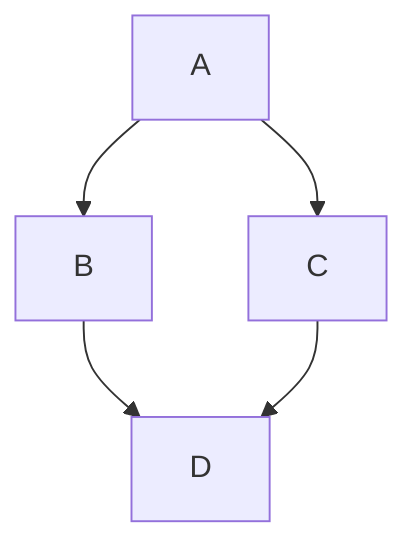

# mt 💡

[](https://github.com/odosui/mt/actions/workflows/ci.yml)

Knowledge management meets spaced repetition.

**mt** helps organize and manage knowledge efficiently, helping you remember and make sense of information over time.

[Read the docs](https://docs.mindthis.io/)


## Features

- Unbeatable UX that just works.
- Markdown-based notes (extensible with plugins) with support for syntax highlighting, [Mermaid](https://mermaid-js.github.io/mermaid/#/) diagrams, and more.
- [Spaced repetition](https://en.wikipedia.org/wiki/Spaced_repetition) techniques for entire notes
- ... and flashcards (like [Anki](https://apps.ankiweb.net/)).
- Notes are stored as markdown files locally on your machine
- Git integration for version control and syncing.
- Cross-linking between notes for building a knowledge graph.
- Full-text search and tagging for easy organization and retrieval.

## Quick start

```bash
# npm modules
npm install
npm run install-client
npm run install-server

# build it
npm run build

# start
node server/dist/index.js
```

Now open your browser and go to `http://localhost:8042`. Your notes are going be stored in `~/mt` (or `C:\Users\YourName\mt` on Windows) by default.

## Using start up script (MacOS/Linux only)

You can use the provided startup script to launch the application as a daemon easily (works on Unix-like systems).

```bash
# start|stop|restart|status
./scripts/mt.sh start
```

## How to use

mt is built around **notes**, which are just pieces of information in plain text or [markdown](https://en.wikipedia.org/wiki/Markdown). These are stored on your machine as plain markdown files.

Notes pop up for **review** according to a predefined schedule (aka spaced repetition). Reviewing your notes helps you remember them better, gives you a chance to improve them, and update them with new information.

Notes can also include flashcards for active recall practice.

### Markdown

Notes are plain markdown files. Markdown is great - it provides simple means to format text, create lists, tables, links, and more. And at the same time it remains readable in plain text.

### Reviewing

Notes you write pop up for review for the first time in 7 days, then in 15 days, in 30, and so on. Press the "Mark as Reviewed" button to review it.

The note will ascend to the next level. There are 10 levels in total. After reaching the last level, the note will not pop up for review anymore.

If you click on the current level in the note toolbar, you can see the whole schedule.

### Cross-linking notes and preview

It is crucial for any knowledge management system to build a **web of knowledge**. Markdown makes it easy with links.

Notes can link to each other using `[text](id)` syntax, where `id` is the numeric identifier of the note. You can find the id in the note toolbar. When stored on disk, the note filename starts with its id.

### Tags and full-text search

A note can have tags (which are just words prefixed with `#` in the note body—they can be anywhere in the text). Tags appear in the sidebar; clicking on a tag shows all notes with that tag.

### Mermaid

Since markdown is extensible, you can use [Mermaid](https://mermaid.js.org/) diagrams in your notes (similar to GitHub markdown):

````

````

### Focus mode

By clicking on the focus icon in the note toolbar, you can enter focus mode, which hides all other UI elements, leaving only the note content visible. This is useful for distraction-free writing.

### Storage

All your notes are stored in a single folder on your computer. You'll need to back them up or sync them between devices yourself. I usually create a git repo and sync it with a private GitHub repository.

### PWA

mt is a Progressive Web App (PWA). You can install it on your device like a native app.

## Contributing

Contributions are welcome! Please open issues and pull requests, and follow the code of conduct.

## Documentation

Docs are present as an `mt` knowledge base under `docs/` folder. You can either edit them in your favorite text editor or start the app with `MT_HOME=./docs`. See `package.json` for more details.
