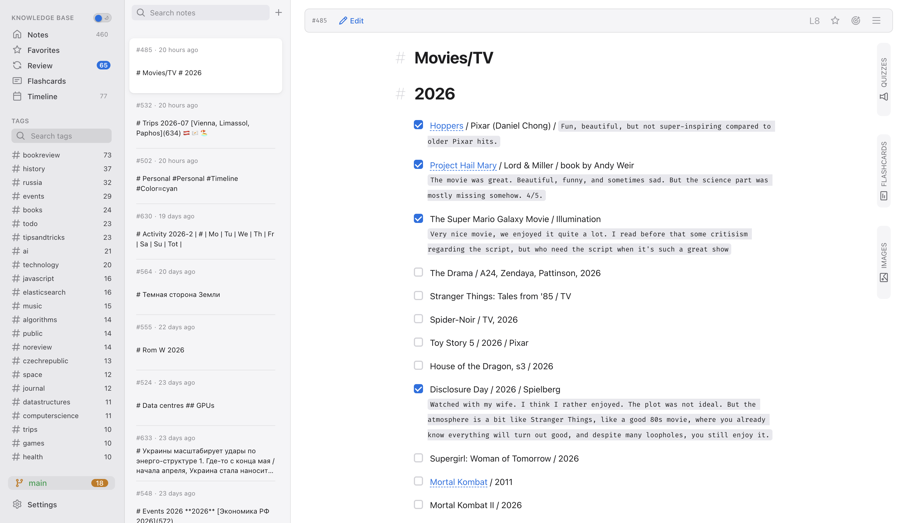
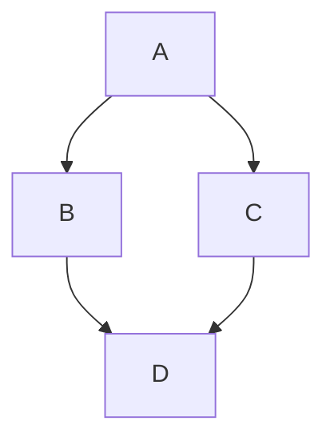

# mt 💡

Knowledge management meets spaced repetition.

**mt** helps organize and manage knowledge efficiently, helps remember and make sense of information over time.



## Features

- Unbeatable UX that just works.
- Markdown-based notes (extensible with plugins) with support for syntax highlighting, [Mermaid](https://mermaid-js.github.io/mermaid/#/) diagrams, and more.
- [Spaced repetition](https://en.wikipedia.org/wiki/Spaced_repetition) techniques for entire notes
- ... and flashcards (like [Anki](https://apps.ankiweb.net/)).
- Notes are just md files stored locally
- Git integration for version control and syncing.
- Cross-linking between notes for building a knowledge graph.
- Full-text search and tagging for easy organization and retrieval.

## Getting Started

It is organized around **notes**, which are just pieces of information in plain text or [markdown](https://en.wikipedia.org/wiki/Markdown). These are stored on your machine as plain markdown files.

Notes are popping up for **review** according to a predefined schedule (aka spaced repetition). Reviewing your notes helps you remember them better, gives a chance to improve them, and update with new information.

Notes can also include flashcards for active recall practice.

## Getting Started

```bash
# npm modules
npm install
npm run install-client
npm run install-server

# start
npm run dev
```

This will both server (port 3000) and client (port 5173). The default directory for notes is `~/mt` ( or `C:\Users\YourName\mt` on Windows).

## How to use

### Markdown

Notes are plain markdown files. Markdown is great - it provides simple means to format text, create lists, tables, links, and more. And at the same time it remains readable in plain text.

### Reviewing

Notes you write popup for a review first time in 7 days, than in 15 days, in 30, and so on. Press "Mark as Reviewed" button to review it.

The note will ascend to the next level. There are 10 levels in total. After reaching the last level, the note will not popup for review anymore.

If you click on the current level in the note toolbar, you can see the whole schedule.

### Cross-linking notes and preview

It is crucial for any knowledge management system to build a **web of knowledge**. Markdown makes it easy with links.

Notes can link to each other using `[text](id)` syntax where id is just a numeric identifier of the note. You can find the id in the note toolbar. Also when stored on disk, the note filename starts with its id.

### Tags and full-text search

A note might have tags (which are just words prefixed with `#` in the note body, they can be anywhere in the text). Tags then appear in the sidebar, clicking on a tag shows all notes with that tag.

### Mermaid

Since markdown is extensible, you can use [Mermaid](https://mermaid.js.org/) diagrams in your notes (similar to GitHub markdown):



### Focus mode

By clicking on the focus icon in the note toolbar, you can enter focus mode, which hides all other UI elements, leaving only the note content visible. This is useful for distraction-free writing.

### Storage

All your notes are stored in a single folder on your computer. It is your task to back them up, or sync between devices. I usually create a git repo, and sync it with a private GitHub repo.

### PWA

mt is a Progressive Web App (PWA). You can install it on your device like a native app. Just click the install icon in the address bar of your browser.
