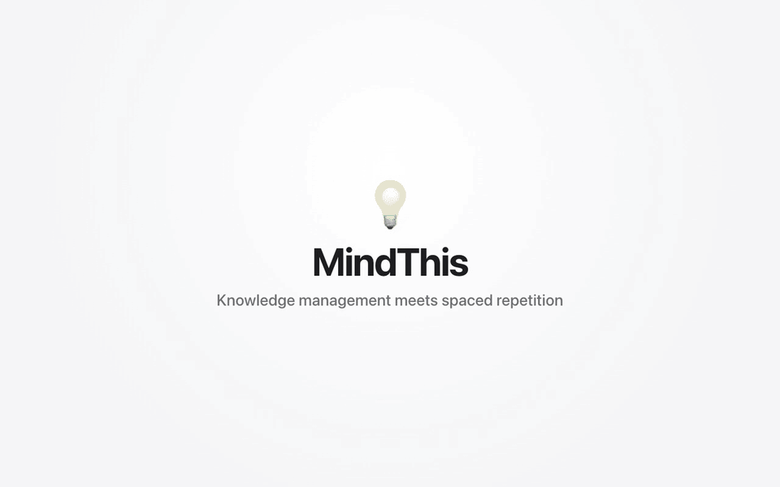
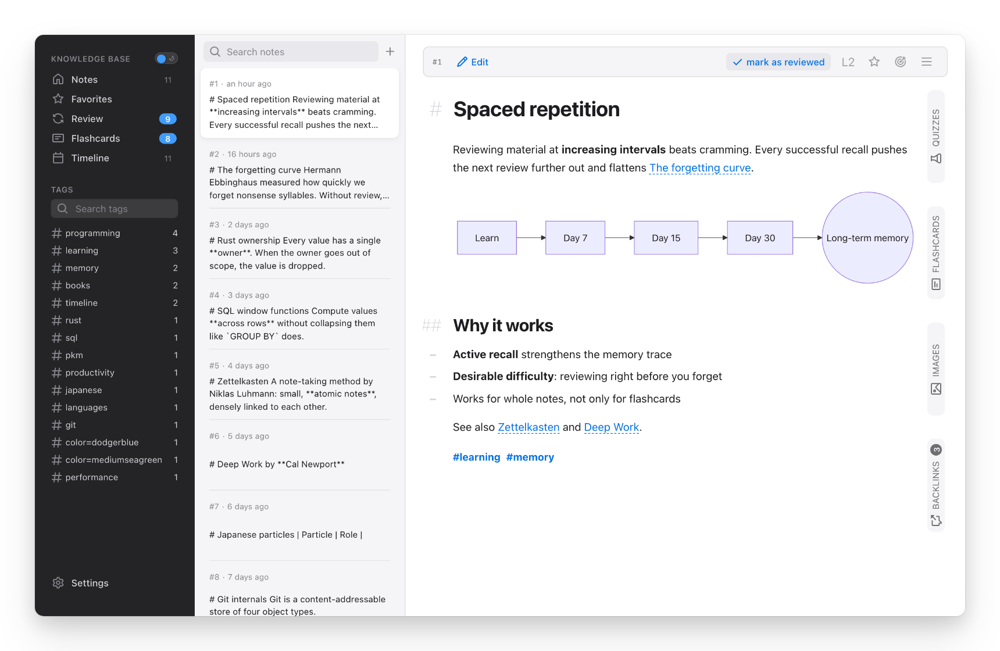
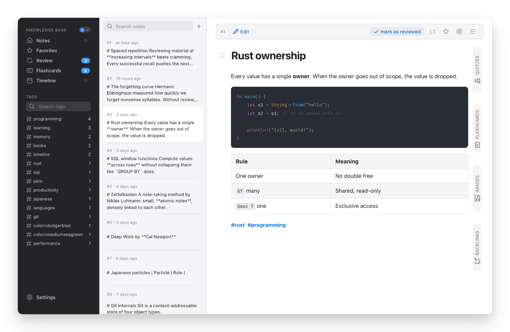
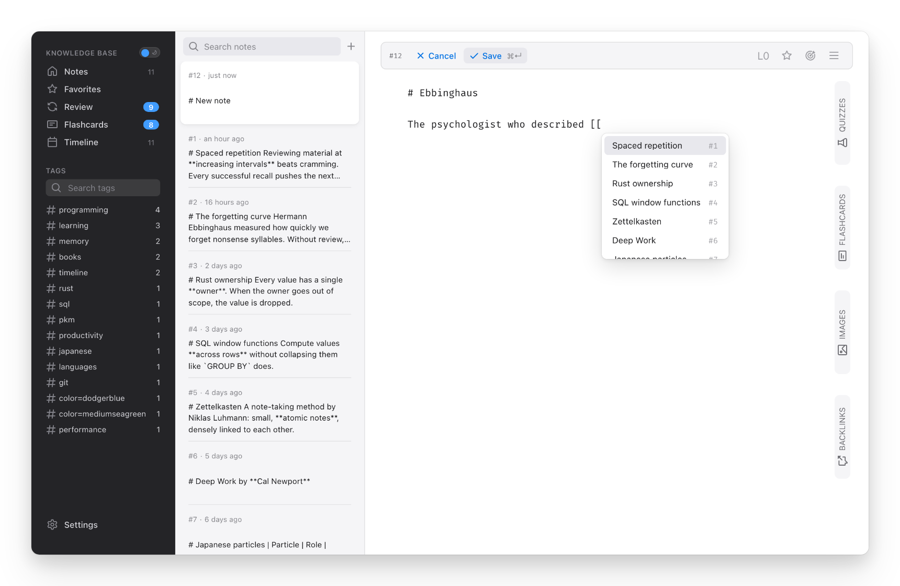
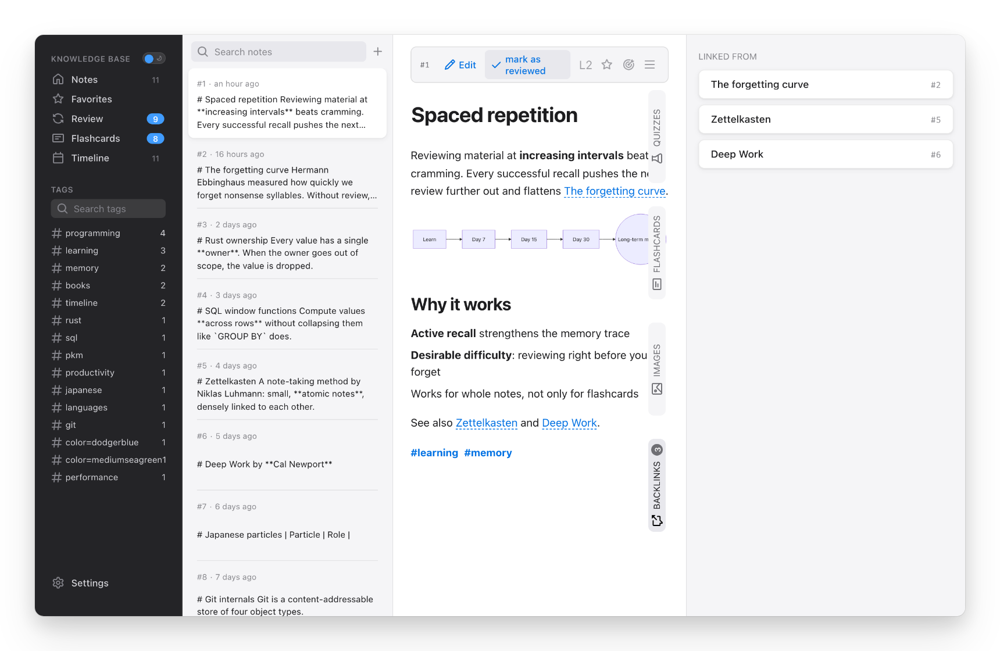
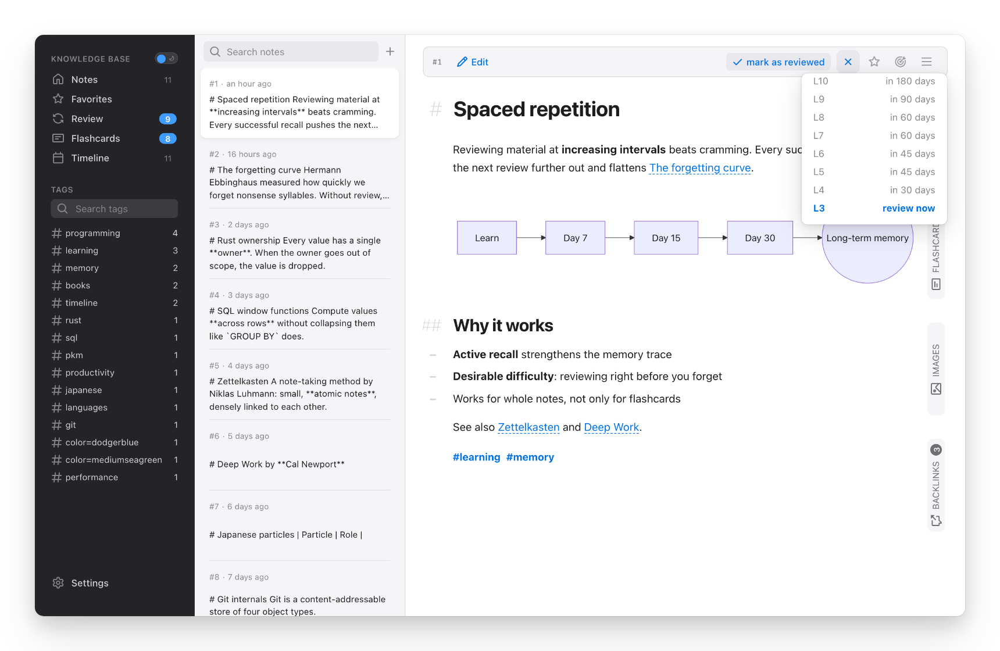
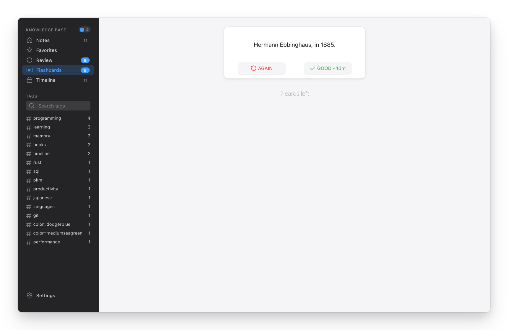
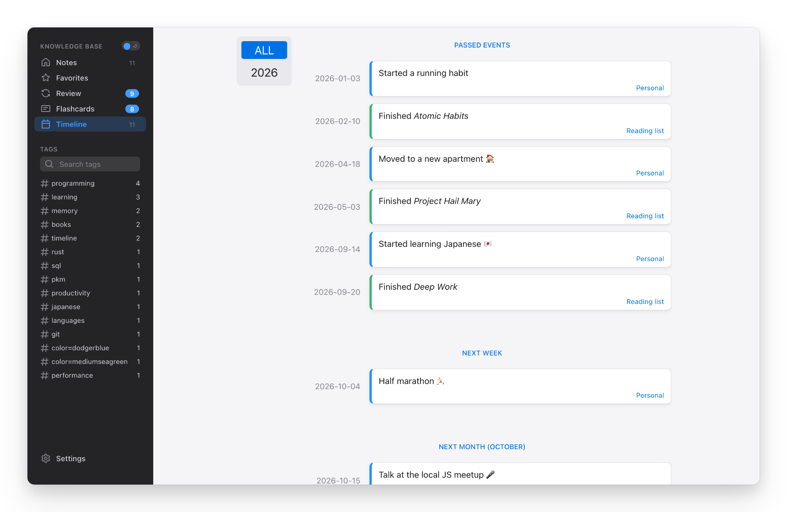
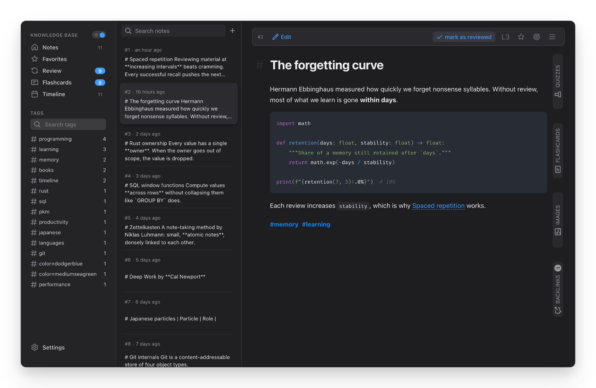

# MindThis 💡

[](https://github.com/odosui/mt/actions/workflows/ci.yml)
[](https://hub.docker.com/r/hiquest/mt)
[](https://hub.docker.com/r/hiquest/mt)
[](https://hub.docker.com/r/hiquest/mt)
[](LICENSE)

Knowledge management meets spaced repetition.

**MindThis** (`mt` for short) helps you organize and retain knowledge over time.

[Read the docs](https://docs.mindthis.io/)



## Overview

MindThis is built around **notes**, which are simple [markdown](https://en.wikipedia.org/wiki/Markdown) files stored locally on your computer.

Notes pop up for **review** according to a predefined schedule (aka spaced repetition). Reviewing your notes helps you remember them better, gives you a chance to improve them, and update them with new relevant information.

Add **flashcards** relevant to each note, review them Anki-style for active recall.

You can also create quizzes for yourself using AI (an API key is required).

### Documentation

- [Learn about MindThis](https://docs.mindthis.io/introduction.html)
- [Create your first note](https://docs.mindthis.io/create-first-note.html)
- [Reviewing](https://docs.mindthis.io/reviewing-notes.html)
- [Flashcards](https://docs.mindthis.io/flashcards.html)
- [Practical tips](https://docs.mindthis.io/what-makes-a-good-knowledge-graph.html)

## Features

- Intuitive but powerful UI.
- Markdown-based notes (extensible with plugins) with support for syntax highlighting, [Mermaid](https://mermaid-js.github.io/mermaid/#/) diagrams, and more.
- [Spaced repetition](https://en.wikipedia.org/wiki/Spaced_repetition) for entire notes, flashcards (like [Anki](https://apps.ankiweb.net/)), and AI-powered quizzes (API key required).
- Your data is stored locally on your machine.
- Git integration for version control and syncing.
- Cross-linking between notes for building a knowledge graph.
- Full-text search and tagging for easy organization and retrieval.

### A quick tour

<table>
  <tr>
    <td width="50%">
      <a href="media/screenshots/notes.png"></a>
      <p><b>Markdown notes.</b> Plain <code>.md</code> files on your disk, rendered with headings, lists, links and Mermaid diagrams.</p>
    </td>
    <td width="50%">
      <a href="media/screenshots/code.png"></a>
      <p><b>Code and tables.</b> Syntax highlighting for code blocks, plus GitHub-flavored tables.</p>
    </td>
  </tr>
  <tr>
    <td width="50%">
      <a href="media/screenshots/linking.png"></a>
      <p><b>Link as you type.</b> Type <code>[[</code> to link another note, or <code>#</code> to pick a tag.</p>
    </td>
    <td width="50%">
      <a href="media/screenshots/backlinks.png"></a>
      <p><b>Backlinks.</b> See every note that links to the one you're reading.</p>
    </td>
  </tr>
  <tr>
    <td width="50%">
      <a href="media/screenshots/review.png"></a>
      <p><b>Review whole notes.</b> Notes come back on a growing schedule (7, 15, 30 days and beyond), so you reread and improve them.</p>
    </td>
    <td width="50%">
      <a href="media/screenshots/flashcards.png"></a>
      <p><b>Flashcards.</b> Attach cards to any note and review them Anki-style: "Again" or "Good".</p>
    </td>
  </tr>
  <tr>
    <td width="50%">
      <a href="media/screenshots/timeline.png"></a>
      <p><b>Timeline.</b> Lines starting with a date in notes tagged <code>#timeline</code> become one chronological view of past and upcoming events.</p>
    </td>
    <td width="50%">
      <a href="media/screenshots/dark-mode.png"></a>
      <p><b>Dark mode.</b> Follows your system setting, or toggle it from the sidebar.</p>
    </td>
  </tr>
</table>

## I just want to try it out

A web version is coming soon.

## Installation (Docker)

The easiest way to run MindThis is with Docker Compose.

1. Download [`docker-compose.yml`](docker-compose.yml) from this repository.
2. Optionally, set the `ANTHROPIC_API_KEY` variable to enable AI-powered features.
3. Run:

```bash
docker compose up -d
```

Your notes are stored in `./mt-data` on your host machine (created automatically).

Open your browser and go to `http://localhost:3042`.

## Installation (Manual)

```bash
# npm modules
npm install
npm run install-client
npm run install-server

# build it
npm run build

# start
node server/dist/index.js
```

## Quick start

Open your browser and go to `http://localhost:8042`. Your notes will be stored in `~/mt` (or `C:\Users\YourName\mt` on Windows) by default.

[Read how to add a first note here](https://docs.mindthis.io/create-first-note.html)

### Optional: git integration

Once you add a note you can initialize a git repository `git init` inside your `mt` home directory (`~/mt` by default). As for now, MindThis doesn't commit changes for you, so if you care about versioning, do it manually. I have a private GitHub repo where I push my changes to keep them backed up.

## Using a start up script (MacOS/Linux only)

You can use the provided startup script (`./scripts/mt.sh`) to launch the application as a daemon easily (works on Unix-like systems).

```bash
# start|stop|restart|status
./scripts/mt.sh start
```

```bash
# add an alias
alias mt="$PATH_TO_MT/scripts/mt.sh"
```

## Contributing

Contributions are welcome! Please open issues and pull requests.

### AI usage

AI usage is allowed. Just make sure you review the code before submitting.

## License

MindThis is released under the [MIT License](LICENSE).
